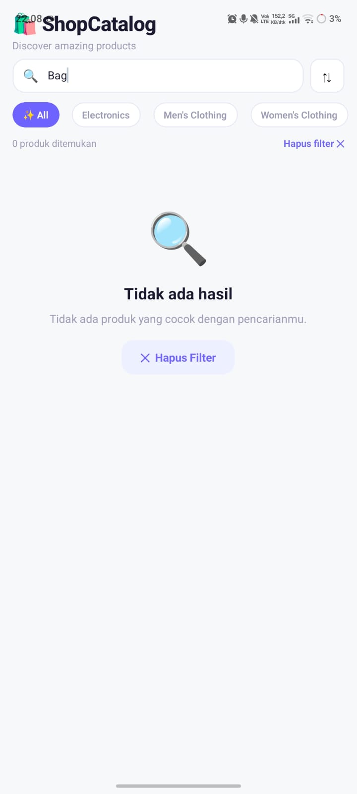

# 🛍️ ShopCatalog

Aplikasi katalog produk e-commerce berbasis React Native (Expo) yang menampilkan data real-time dari FakeStore API, lengkap dengan fitur pencarian, filter kategori, sorting, dan detail produk.

---

## 📱 Screenshots

### Success State


### Error State


---

## 🌐 API yang Dipakai

**FakeStore API** — https://fakestoreapi.com/products

Mengembalikan array produk e-commerce berisi: id, title, price, description, category, image, rating.

---

## ✅ Daftar Fitur

### 🟢 Level 1 — Core
- Fetch data dari FakeStore API menggunakan `async/await`
- `useEffect` dengan dependency array `[]` (fetch sekali saat mount)
- 3 kondisi UI: Loading (skeleton), Error (pesan + tombol retry), Success (FlatList)
- `try/catch/finally` — loading selalu dimatikan di `finally`
- `FlatList` dengan `data`, `renderItem`, `keyExtractor`
- Kartu item menampilkan: gambar, judul, harga, rating, jumlah review
- Tombol "🔄 Coba Lagi" yang memanggil ulang fungsi fetch saat error

### 🟡 Level 2 — Pengembangan (4 Fitur)
- **Search/Filter** — TextInput untuk filter produk berdasarkan nama/kategori secara lokal
- **Pull-to-Refresh** — tarik layar ke bawah untuk fetch ulang data (`RefreshControl`)
- **Layar Detail** — tap kartu produk → Modal berisi info lengkap (gambar, deskripsi, harga, rating, tier)
- **Filter Kategori** — chip kategori horizontal untuk filter berdasarkan kategori tertentu
- **Empty State** — tampilan ramah dengan ilustrasi dan tombol "Hapus Filter" saat hasil kosong

### 🔴 Level 3 — Bonus
- **Skeleton Loading** — placeholder abu-abu beranimasi shimmer saat loading (bukan sekadar spinner)
- **Sorting** — urutkan berdasarkan harga (naik/turun), nama (A-Z/Z-A), dan rating tertinggi
- **Animasi fade-in** — kartu muncul dengan animasi fade + slide menggunakan Animated API

---

## 🚀 Cara Menjalankan

### Prasyarat
- Node.js versi 18 atau lebih baru
- Aplikasi Expo Go di HP (Android/iOS)

### Langkah

```bash
# 1. Clone repository
git clone https://github.com/USERNAME/ShopCatalog.git
cd ShopCatalog

# 2. Install dependencies
npm install

# 3. Jalankan
npx expo start

# 4. Scan QR code dengan Expo Go
```

> Pastikan HP dan laptop terhubung ke WiFi yang sama!

---

## 🛠️ Tech Stack

| Teknologi | Kegunaan |
|---|---|
| React Native | Framework utama |
| Expo ~50.0 | Build toolchain & dev server |
| JavaScript ES2022 | Bahasa pemrograman |
| FakeStore API | Sumber data produk |

### Hooks yang digunakan
- `useState` — manajemen state
- `useEffect` — fetch data saat mount
- `useCallback` — memoize fungsi fetch
- `useMemo` — filter & sort produk efisien
- `useRef` — Animated values
- `Animated API` — animasi fade-in & skeleton shimmer

---

## 📁 Struktur Project
